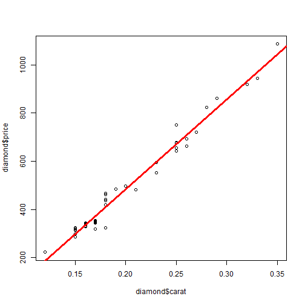

A web application for estimating diamond price
====================================================
author: YZZheng
date: April 27, 2015

====================================================

### Requirements:

- library(shiny)
- library(UsingR)
- data(diamond)
- "ui.R" and "server.R" files are in the subdirectory "cp"
- setwd("The directory and the subdirectory called "cp")
- Run the code: runApp("cp"), the interactive web app will - show up in the local window or externally on web browser

=====================================================


```r
library(shiny)
library(UsingR)
data(diamond)
summary(diamond)
```

```
     carat            price       
 Min.   :0.1200   Min.   : 223.0  
 1st Qu.:0.1600   1st Qu.: 337.5  
 Median :0.1800   Median : 428.5  
 Mean   :0.2042   Mean   : 500.1  
 3rd Qu.:0.2500   3rd Qu.: 657.0  
 Max.   :0.3500   Max.   :1086.0  
```

=================================================


```r
plot(diamond$carat, diamond$price)
abline(lm(price ~ carat, data=diamond), col="red", lwd=3)
```

 

=================================================
So, there is clear linear relationship between the diamond weight and price. We can use linear regression model to predict the price from the weight, such as:


```r
mode1 <- lm(price~carat, data=diamond)
pred1 <- predict(mode1, data.frame(carat=0.275))
pred1
```

```
       1 
763.6559 
```
